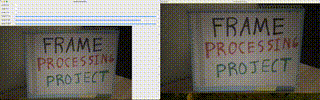

# Real-time Webcam Processing with Live Display

This project provides real-time webcam processing, where the user can choose different image processing modes, such as grayscale, HSV, and blur, and see both the original live feed and the processed image simultaneously.

The user can switch between different modes in real-time while the webcam feed is live.

# Examples

## Color Detection using HSV

## Color Detection using RGB

## Color Isolation

## Canny Edge Detection

# Features

1. Grayscale Conversion: 
Converts the input image to grayscale, removing all color information and simplifying the image for analysis.

        Input: None
        Output: Grayscale image displayed in a window.
  
3. HSV Conversion: 
Converts the input image to the HSV (Hue, Saturation, Value) color space, which is often more effective for color-based segmentation and manipulation.

        Input: None
        Output: HSV image displayed in a window.
3. Gaussian Blur: 
Apply a Gaussian blur to the image, which softens the edges and reduces noise. The user can define the kernel size for the blur.

        Input: Kernel size (odd number, e.g., 3, 5, 7).
        Output: Blurred image displayed in a window.
4. Thresholding: 
Apply binary thresholding to the image, which segments the image into black and white regions based on a specified threshold value.

        Input: Threshold value (0-255).
        Output: Binary thresholded image displayed in a window.
5. Cropping: 
Crop a specific region from the image by specifying the top-left corner coordinates and the dimensions (width and height).

        Input: x, y (coordinates of the top-left corner), width, height (dimensions of the crop).
        Output: Cropped image displayed in a window.
6. Resizing: 
Resize the image to the specified width and height.

        Input: New width and height.
        Output: Resized image displayed in a window.
7. Rotation: 
Rotate the image by a specified angle. Positive values rotate the image clockwise, and negative values rotate it counterclockwise.

        Input: Angle (in degrees).
        Output: Rotated image displayed in a window.
8. Convolution: 
Apply a custom convolution filter to the image. Users can define the kernel size (odd number) and provide the kernel values in a row-major format.

        Input: Kernel size (odd number), kernel values.
        Output: Convolution result displayed in a window.
9. Erosion: 
Apply the erosion operation, which shrinks white regions in the image and helps to remove small white noise elements.

        Input: Kernel size (odd number).
        Output: Eroded image displayed in a window.
10. Dilation: 
Apply the dilation operation, which enlarges white regions in the image and helps to fill small holes or gaps in white regions.

        Input: Kernel size (odd number).
        Output: Dilated image displayed in a window.
11. Canny Edge Detection: 
Detect edges in the image using the Canny edge detection algorithm. Users can specify the lower and upper thresholds for edge detection.

        Input: Lower threshold, upper threshold.
        Output: Canny edge-detected image displayed in a window.
12. Color Detection: 
Detect and highlight regions of the image that match a specific color. Users can define the minimum and maximum values for the RGB color channels.

        Input: Minimum and maximum values for the R, G, and B channels.
        Output: Image highlighting regions that match the specified color range.
